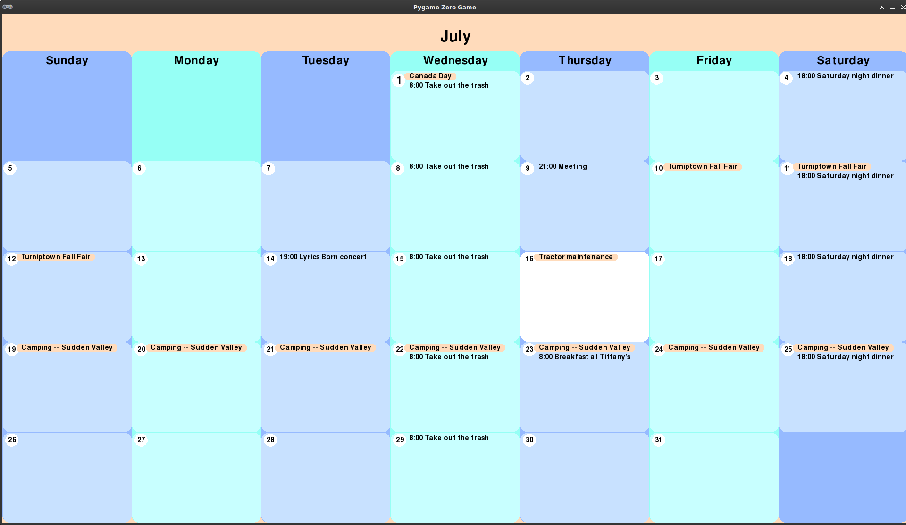

# CalendarDashboard
Simple display for a Google calendar optimized for a Pi Zero. The primary purpose is to have a dynamic, legible calendar
display visible for the family to see.

The display is read-only from here, but updates every minute, so changed made elsewhere (eg phone, computer) can be
reflected is the display. It is designed to run on older cinematic TVs. It should be usable on a 720p display, but is
optimized for a 1080p screen.

## Settings
Read on startup from **settings.xml**, including colours and database names.

## Controls
| Key    |     Action     |
|--------|:--------------:|
| ->     |   Next month   |
| <-     | Previous month |
| ALT+F4 |      Quit      |

## Future Changes
- Day display
- Week display
- Read entire month at once and parse it. Currently, it reads events one per day in the month, which is inefficient.