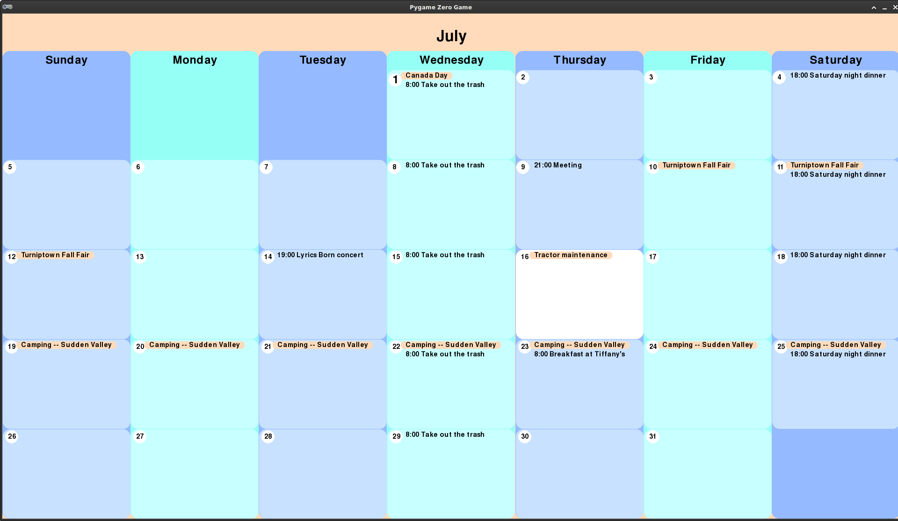

# CalendarDashboard
Simple display for a Google calendar optimized for a Pi Zero. The primary purpose is to have a dynamic, legible calendar
display visible for the family to see on devices that struggle with browsers.

The display is read-only from here, but updates every minute, so changed made elsewhere (eg phone, computer) can be
reflected is the display. It is designed to run on older cinematic TVs. It should be usable on a 720p display, but is
optimized for a 1080p screen.

## Settings
Read on startup from **settings.xml**, including colours and database names.

## Controls
| Key    |            Action            |
|--------|:----------------------------:|
| ->     |     Next month/week/day      |
| <-     |   Previous month/week/day    |
| Up     | Switch mode month->week->day |
| ALT+F4 |             Quit             |

## Running
If the device is a Pi Zero (and thus may not have the horsepower to run a web browser), do the following on both the Zero and a more capable machine:
- Clone or download package to destination device.
- Have Python 3 installed (Python 3.13 supported).
- Run the **setup** script.
- Edit **caldash.sh** to reflect the installed directory.
- Edit **Settings.py**'s **\<SOURCE\>** tag to point to the name of the calendar you wish to display.
- Execute **./caldash.sh** on the browser-capable machine.
  - A web page should pop open prompting to trust Calendar Dashboard. Accept.
- A new file, **token.json** should appear in CalendarDashboard/.
  - Copy this file to the same directory on the Zero.
- (Optional) On the Zero, set up an Autostart job to run the application on startup.

## Future Changes
- Read entire month at once and parse it. Currently, it reads events one per day in the month, which is inefficient..
- Time range for evemts, eg "3:00-4:00" instead of just "3:00".
- Alerts for upcoming events.
- Day title day number should have no leading zeros.
  - Also add numeric suffixes (1st, 16th, etc.).
- Use a better font, eg Comic Sans. Everybody likes Comic Sans.